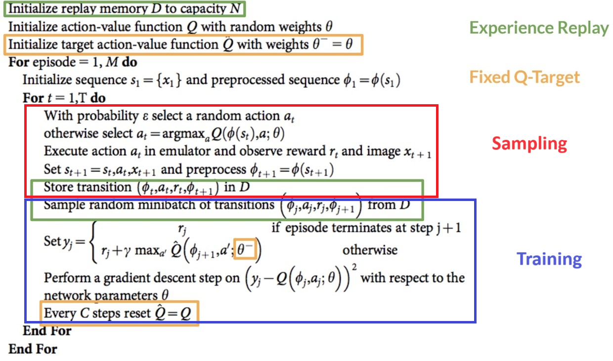
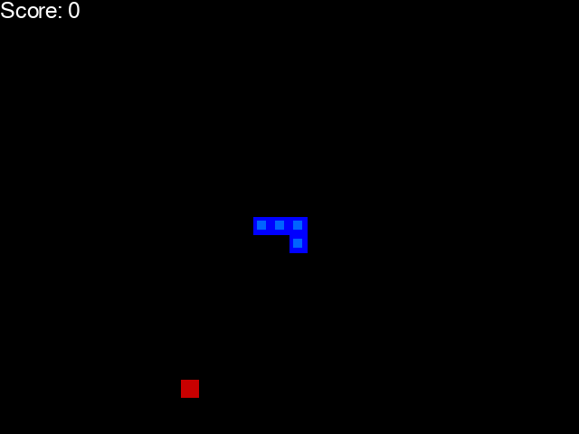
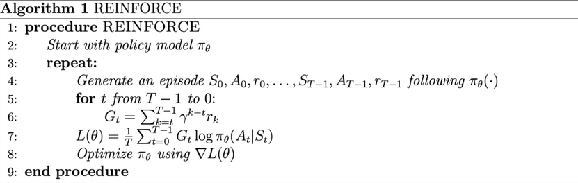
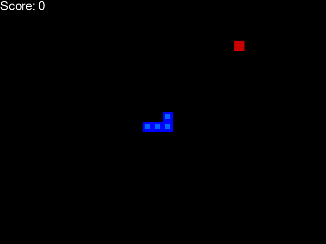

# Introduction

This project aims to train an agent by **Reinforcement Learning (RL)** to play the Snake game. The main idea is to give the snake a **reward** when eating or approaching the food and a **negative reward** when losing the game or when moving away the food. The model will update its parameters in order to maximize this rewards.

It is interesting to see how the behavior of the **DQN** is **smoother** and the behavior of the **PGM** is **more chaotic**. The agent trained with **NEAT** does not. I even tried to penalize revisiting positions or or lasting only a few turns, but that dit not work. May be more epochs were needed.

The GIFs were made based on this [code](https://gist.github.com/RicardoRibeiroRodrigues/9c40f36909112950860a410a565de667).

There are three different ways to train the agent:

## Deep Q-Learning (DQN)

The main idea is to approximate the real values of the Q-table using a Neural Network.

## Policy Gradient Methods (PGM)

The main idea is to maximize the reward obtained at each step given the policy used to act. Not only the reward at each step is considered, but also the rewards obtained in next steps, with a discount of $\gamma$ depending on how far in the future that reward is. For example, the reward in step 1 is the reward at step 1, plus $\gamma$ times the reward at step 2, plus $\gamma^2$ times the reward at step 3... In summary, the reward obtained at step $k$ is $$G_k=\sum_{t=k}^T\gamma^{t-k}r_t,$$ where $T$ is the total number of episodes and $r_t$ the reward obtained at step $t$.

## NeuroEvolution of Augmenting Topologies (NEAT)

It is based on this [paper](https://nn.cs.utexas.edu/?stanley:ec02) and implemented by this [library](https://neat-python.readthedocs.io/en/latest/).

# How to use

To train DQN just execute in terminal:

    python -m src.agent_dqn.train

The parameters can be changed in the same file. For training PGM and NEAT is the same.

To see how an agent plays execute in terminal:

    python -m src.main

The agent can also be changed in the same file.

# Ideas to improve

Right now, the inputs of the Neural Networks are the current direction, the relative position to the food and if there are possible collisions around the head of the snake.

Some **more inputs** could be added, like taking into account all the pixels occupied by the snake in order to not collide with itself or even use a **CNN** to pass all the pixels of the frame in order to act. But the idea of the project was not making a perfect agent, but learning about RL!